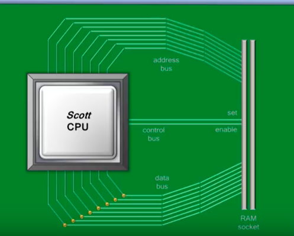
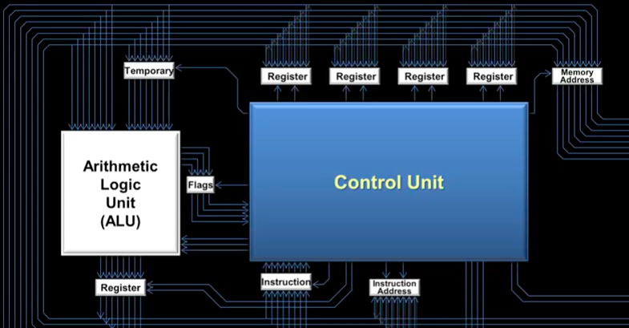

https://www.youtube.com/watch?v=cNN_tTXABUA&feature=share

간단한 CPU 작동 원리

#### 일정한 주기에 맞춰 연산을 한다
 - CPU는 회로가 껐다 켜지는 일정한 주기가 있는데 이를 클럭(clock)이라한다. 클락의 단위가 기가헤르츠(Ghz)라면, 해당 cpu의 회로에선 1초에 수억 번의 껐다 켜짐(clock tick)이 일어난다. 전류가 흐르는 순간에는 CPU내부에서 명령어 처리가 진행된다.

 - 어떤 회로가 활성화될지는 램에 적재된 instruction set에 따라 달라진다. CPU는 프로세스 처리 과정에서 연산을 뜻하는 optcode + 메모리 주소가 담긴 명령어(instruction)을 받고, 그 내용에 따라 레지스터에 가지고 있는 데이터나 혹은 기억장치의 데이터를 불러와 처리한다. 

#### 연산의 종류와 처리 흐름

- instruction set(연산 종류)에는 로딩, 더하기, 저장하기, 비교하기, 점프하기 등이 있다. 점프하기는 CPU가 메모리의 특정 구역을 뛰어 넘어 그 다음 영역에 접근하는 기능을 말한다. 원래 CPU는 Program Counter(PC) 레지스터가 가리키는 램 주소에 접근해서 명령어와 값이 담긴 2진수 데이터를 읽고 Instruction Register에 저장한다. 이 과정에서 PC값이 1씩 커지기 때문에 CPU는 결국 순차적으로 램주소를 읽게된다. 하지만 만약 점프/비교하기 기능이 실행되면, 예외적으로 처리 순서가 달라진다. 그 외 PUT(출력) / IN(입력) 기능이 있는데, PUT은 데이터를 출력 장치로 보내는 것이고 IN은 그 반대다.

- Control Unit(이하 CU)는 어드레스 버스와 데이터 버스를 통해 램을 포함한 외부 장치와 커뮤니케이션을 담당한다. 명령을 처리해야 할 때 CU는 램에서 이진수로 된 instruction 값을 불러와 instruction 레지스트리에 저장한다. 명령에 필요한 데이터가 레지스트리에 있다면 ALU로 보내고, 없으면 이진수 명령어 내에서 가리키고 있던 메모리에 접근해 데이터를 가져온다. 이 때 직접적으로 램에 접근하지 않고, 메모리 주소 레지스트리의 중개를 받는다. 

ALU가 CU에서 제공받은 데이터와 명령으로 결과값을 내놓으면 그 값은 임시적으로 자기 주변에 있는 레지스터로 옮겨진다. 이 때 CU에서 set 회로에 전류가 흐르면 레지스터의 값은 버스를 통해 CPU의 다른 컴포넌트로 옮겨질 자격을 갖는다. 만약 set이 발현되지 않으면 레지스터에 머물던 값은 ALU의 다음 아웃풋에 의해 사라진다. set회로가 활성화된 후, CU에서 enable 회로를 활성화 하면, 레지스터에 있던 값은 버스를 타고 CU주변의 레지스트리로 이동한다.

버스와 CU 사이에도 여러 레지스터가 존재하는데 이를 레지스터 셋이라 한다. CU는 ALU 근처 레지스터에서 가져온 값을 여기에 적재시킨다. 추가적인 연산이 일어날 때 레지스터 셋에 적재한 데이터를 ALU로 보낼 수 있다.

인스트럭션도 임시 레지스트리에 저장되는데 인스트럭션 레지스터와 인스트럭션 어드렛 레지스터로 나뉜다. 어드레스 레지스터는 instruction을 마친 뒤 다음 instruction을 가져오기 위해 활성화 되는데, CU에서 enable회로를 활성화하면 CPU와 RAM을 연결하는 어드레스 버스로 신호가 전달된다. 이 때 앞서 말했듯이, 램에 직접적으로 접근하는 것이 아니라 CU와 램 사이에 있는메모리 어드레스 레지스터에 접근한다.
