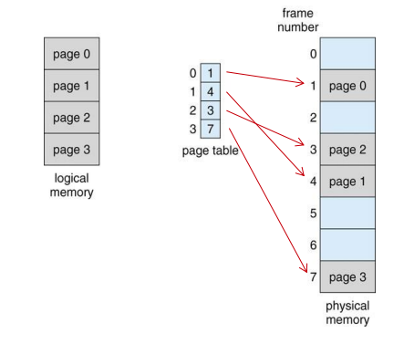

### Physical Memory와 Logical Memory

Physical Memory

메모리에 실질적으로 존재하는 물리적 주소를 말한다. 프로세스(실행 중인 어플리케이션) 용량이 적었던 시기에는 메모리의 물리적 주소만으로 프로세스 데이터 관리가 가능했다. 하지만 프로세스 용량이 커지고 멀티 태스킹이 요구되면서, 물리적 주소 하나로는 프로세스 처리에 어려움이 생겼다.

Logical Memory

물리적 메모리에 새로운 수치를 매핑한 메모리 주소다. 물리적 메모리 상에서 프로세스가 처음으로 지정된 주소를 `base`로 보고, 이 지점부터 메모리 주소를 0으로 본다. Logical Memomry를 활용해 CPU에게 램이 가진 물리적 용량보다 더 큰 용량을 인식시컬 수 있다. 그리고 그 차이만큼 하드디스크에 프로세스 데이터 공간을 확보해 놓는다.


하드디스크에 있는 데이터를 메모리로 가지고 오려면 하드디스크의 주소가 도착할 램 메모리 주소를 먼저 알아야 한다. 이 정보를 가지고 있는 것이 바로 페이지 테이블이다.



#### 페이지, 페이지 프레임, 페이지 테이블 개념 설명
<!-- 
(64비트를 가정) 4kb 간격으로 끊어진 가상메모리 구역과 실제 메모리를 매핑한다. 이 때 가상 메모리 한 구간(블록)을 `페이지`, 실제 메모리의 구역을 `페이지 프레임`이라 한다. -->

- 페이지 : 보통 4kb의 간격을 가진다. 이렇게 간격을 나누는 이유는 하드디스크에 불필요한 가상 메모리 공간을 만들지 않으려는 데 있다. 32kb면 어플리케이션마다 최대 4기가를 하드디스크에 확보할 수 있지만, 모든 어플리케이션이 4기가를 할당받으면 하드디스크 사용에 제약이 생긴다.(데이터 불러오는 속도도 마찬가지.) 그래서 조금씩 구역을 나눠 필요한 만큼만 가상메모리를 하드디스크에 부여하도록 했다.

- 페이지 프레임 : 페이지와 매핑되어 있는 물리적 주소 구간을 페이지 프레임이라 한다.

- 페이지 테이블 : 페이지 프레임과 페이지의 관계를 표로 정리한 것이 페이지 테이블이다. 페이지 테이블에 가상 메모리 주소와 매칭되는 물리적 주소가 없으면, 하드디스크에서 스왑 파일을 불러온다. 

- 모든 어플리케이션은 하나의 페이지 테이블을 가진다. 페이지 테이블에는 페이지 번호와 페이지에 있는 물리적 주소가 적혀있다. 하드디스크와 램의 페이지 번호를 매칭시키는 것이 MMU의 역할이다. MMU는 램에 존재한다.  

### 하드디스크(가상 주소 + 가상메모리)에서 램(물리적 메모리)에 할당하는 순서


1) 명령(Instruction)을 처리하는 프로세서에서 특정 데이터를 요구한다.

2) 우선 TLB라는 버퍼에 접근해 필요한 데이터가 실제로 위치한 주소를 알아본다. TLB버퍼에 없을 경우(TLB miss), MMU의 페이지 테이블을 보고 필요한 데이터가 어떤 메모리에 위치하고 있는지 알아낸다. 만약 테이블에서 주소가 발견되면, TLB의 내용을 업데이트 한다.(option)

3) 2)에서 주소를 발견했을 때 운영체제는 메모리 접근이 유효한지 확인한다. 유효한 접근이면 가상 주소를 쓰고 있는 하드 디스크로 접근을 허용한다. 

4) 하드디스크에서 필요한 데이터를 램에 적재한다. 이 때 메모리에 적절한 공간이 없으면, 자주 쓰지 않는 데이터를 하드디스크에 집어 넣는다. 빈 공간이 생기면 데이터를 램에 적재한다.

5) 4)의 내용을 페이지 테이블에 업데이트한다.

#### 주소를 찾는 순서

1.TLB 버퍼


= 일종의 캐시로서 예전에 사용한 프로세스 메모리 주소가 저장되어 있다. 페이지 테이블을 바로 사용하면 데이터에 접근하기까지 검색 비용이 크기 때문에, TLB를 사용해 검색 시간을 줄여준다.

2.페이지 테이블

= 1번에 없으면, 페이지 테이블에서 필요한 데이터의 주소를 검색한다. 페이지 테이블은 램에 MMU란 곳에 존재하는데, 현재 메모리에 어떤 데이터가 올라가 있는지, 어떤 데이터가 하드디스크에 존재하는지 보여준다. 원하는 데이터 주소를 찾게 되면 1번으로 옮겨놓고 그 다음 작업을 수행한다.

3.스왑

= 페이지 테이블에서 주소를 찾지 못했을 때 발생한다.

<!-- 
```
logical_address / page_size
508 mod 256 = 252
```
508/256  = 1.xx 여기서 1이 `page_number`가 된다.
( physical_page_number * page_size ) + offset


508/256 = 1 // virtual memory page 값. 이 값을 트랜지션 테이블에서 찾는다. 만약 값이 2라면..

```
2 * 256 + 252 = 764
```

Q) 만약 페이지 테이블에서 페이지 넘버가 14고 0~4k구간의 페이지프레임이라면?

A)
```
14 = 111(2) // 페이지
0 0000 0000 0001 // 페이지 프레임
```
페이지 프레임에서 사용되지 않음을 뜻하는 0번 구간은 하드디스크에 할당해둔다. -->

<!-- 이 방식으로 메모리를 관리해도 메모리 용량이 부족할 때가 있다. 그렇게 되면 메모리에서 자주 쓰지 않는 부분을 하드디스크로 옮기고, 메모리의 공간을 확보한다. -->

#### 스왑(Swap)
브라우저 어플리케이션과 동시에 다른 프로그램을 실행할 때가 있다. 이 경우에 컴퓨터는 각각 어플리케이션에 동일한 메모리를 부여한다. 인식시킬 수 있는 방법은 스왑이라는 방법을 통해서다. 두 프로그램 중에서 특정 프로그램에 메모리 의 많은 부분을 부여해야할 때, 메모리를 할당받지 못하는 프로그램은 램에 적재되어 있던 파일을 `스왑 파일`로 만들어 저장해놨다가 이후에 필요할 때 램에 다시 불러온다.이렇게 되면 둘다 동일한 램 영역을 가지게 된다.

