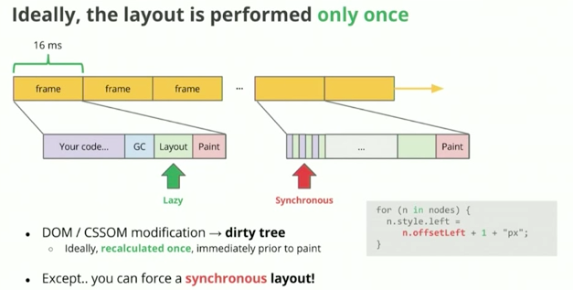

### 브라우저 렌더링

#### 이상적인 브라우저 렌더링 순서

`Javascript → Recalculate style → Layout → Paint → Composite layers`

브라우저는 1초에 60프레임을 생성한다. 1프레임당 가질 수 있는 시간 16ms에서 가장 이상적인 렌더링 순서는 위와 같다.




하지만 대개 레이아웃 작업이 중간중간 일어나게 된다.

```c
for ( n in nodes) {
n.style.left =
n.offset + 1 + "px";
}
```
자바스크립트 코드인 for문 바디로 제어권이 들어가면, 노드의 포지션에 변화가  생겨 레이아웃 작업이 발생한다. 이 흐름은 `자바스크립트 코드 -> 레이아웃` 작업이 반복되므로, 이상적인 렌더링이 이뤄지지 않는다.


### 리플로우/리페인팅
렌더링 트리를 바탕으로 노드를 화면의 1)어느 위치에 2)어떤 크기로 보여줄지 결정하는 *리플로우* 과정이 일어난다. 그 뒤 배경색, 테두리와 같은 시각적 속성을 입히는 *리페인트* 과정이 일어난다.

만약, 위치/크기 혹은 스타일에 변화가 많은 노드의 경우, 브라우저의 리플로우/리페인트 과정이 자주 일어날 수 있기 때문에 기존의 렌더링 트리에서 따로 구분시켜 놓으면 좋다.

구분시키는 방법? position: relative || absolute을 적용하면 전체 렌더링 트리에서 분리되므로, 브라우저의 렌더링 시간이 줄어들 수 있다.

그 외 리플로우와 리페인트를 최소화 시키는 방법들

1. 인라인 스타일을 피한다 
-  인라인 스타일이 변경되면 페이지 전체에 걸쳐 리플로우가 발생한다.

2. wrapper역할을 하는 상위 계층 노드에 클래스 바인딩을 활용한 스타일 변경을 지양한다.
-  DOM 트리 상위에 위치한 노드에 스타일 변경 클래스를 적용할 수록 리플로우의 영향은 커진다. 

    > 스타일 변경을 위한 클래스 바인딩 자체는 나쁜 것이 아니다.

    ```
    let toChange = document.getElementById('elem');

    toChange.style.background = '#333'; // repaint
    toChange.style.color = '#fff'; // repaint
    toChange.style.border = '1px solid #ccc'; // reflow && repaint
    ```

    ```
    /* CSS */
        #elem { border:1px solid #000; color:#000; background:#ddd; }
        .highlight { border-color:#00f; color:#fff; background:#333; }

    /* js */
     <!-- 한번의 리플로우에 여러 스타일 변경이 가능하다. -->
    document.getElementById('elem').className = 'highlight';
    ```

3. `display : table`의 사용을 줄인다
- 표 안에 있는 하나의 셀(cell)이 크기가 달라지면, 다른 셀의 레이아웃도 자연스레 영향을 받으므로 리플로우가 많이 발생할 수 있다.


#### 브라우저 렌더링 - 레이아웃

부모 엘리먼트에서 너비나 높이가 달라지면 리사이징 작업이 일어나는데, 이 작업이 모든 자식 엘리먼트에 영향을 미친다. 그 외 노드를 추가하거나 삭제하는 작업은 브라우저 뷰를 바꾸기 때문에 브라우저에 부담이 될 수 있다. 크롬 개발자 도구로 어떤 코드가 어느 만큼의 노드에 영향을 미치는지 알아야한다.

#### 페인팅

엘리먼트 css스타일링을 마치면 css를 먹은 엘리먼트를 레이어와 함께 비트맵으로 바꾼다. 비트맵에서 계산된 정보를 화면에 보여주기 위해서 픽셀을 입힌다.

*레이어란?
RenderLayers, which are responsible for subtrees of the DOM, and GraphicsLayers, which are responsible for subtrees of RenderLayers.

#### 컴포지팅
레이어(렌더레이어, 그래픽스레이어)를 합침


뷰포트는 네모난 사각형으로 갈라진다. 각각 타일은 렌더링 되고 캐싱된다.

#### 크롬 개발자 도구로 확인해보기
출처 : https://developers.google.com/web/tools/chrome-devtools/rendering-tools/?hl=ko

`크롬 개발자 도구 - Rendering`탭에서 어떤 엘리먼트가 리페인트가 되는지 확인할 수 있다. 항목 중에 `Paint flashing`이란 메뉴가 있는데 이걸 클릭하고 스크롤을 내려보면(뷰에 변화를 주는 이벤트가 일어날 때) 리페인트 작업이 일어나는 엘리먼트를 초록색 네모창으로 확인시켜준다.  


참고)
https://lists.w3.org/Archives/Public/public-html-ig-ko/2011Sep/att-0031/Reflow_____________________________Tip.pdf
